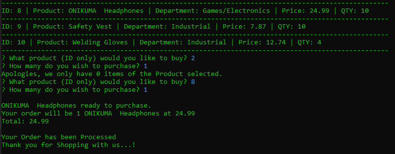

# Bamazon

* A virtual storefront CLI app, minus any evil corporations.

* Made with `Node.js`, `MySQL`, `Inquirer`, `Keys`, and `Javascript`

## To Use:
    * Install Node.js and Bamazon GitHub repo
    * Install application dependencies 
    * Navigate in your terminal/command prompt to your Bamazon folder.
    * Begin every command with `node bamazonCustomer.js`
You are now ready to issue commands to Bamazon!

## Bamazon Commands

1. `node bamazonCustomer.js`

* Once you've installed Bamazon and all of its dependencies, open the command line and type the command above.
The application will then display a table of Bamazon's stock including ID #s, product name, product department, price, and amount
of items currently in stock.

2. Start shopping!
* Now that the app is running and loaded, it will ask you what item you want to buy, via inputting it's unique id number.
    * Putting in an invalid id number like 0, a blank, or a value higher then 10 will prompt an error message.

3. How many did you want to order?
* After that is done you will be prompted again to input how many of that item you wish to purchase!
    * Putting in a quantity number that exceeds the current stock will prompt the shopping queries to begin again.
    * Leaving the field empty or inputting 0 results the app calculating that your purchase of 0 items costs 0.00. I have elected to keep it as is because it is amusing.

4. Finalized purchase.
* Now the application calculates your total, connects with the database, and changes the stock quantity accordingly!

## Thank you for shopping with Bamazon! Support Worker's Rights!

## Acknowledgments

* This would not have been completed without the [video tutorial generously put up on Youtube](https://youtu.be/gfTS4A8WHHE) - for free- by [Dcoxmen](https://github.com/Dcoxmen)
